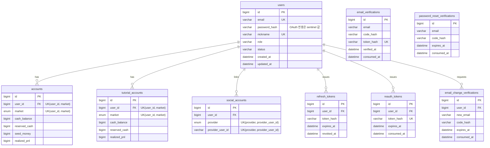
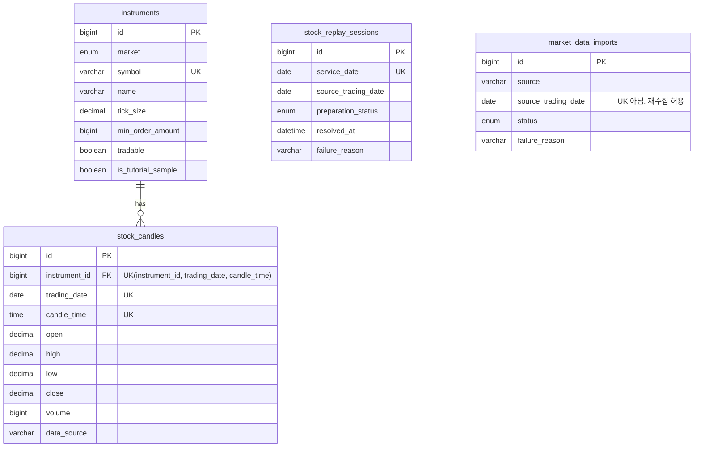
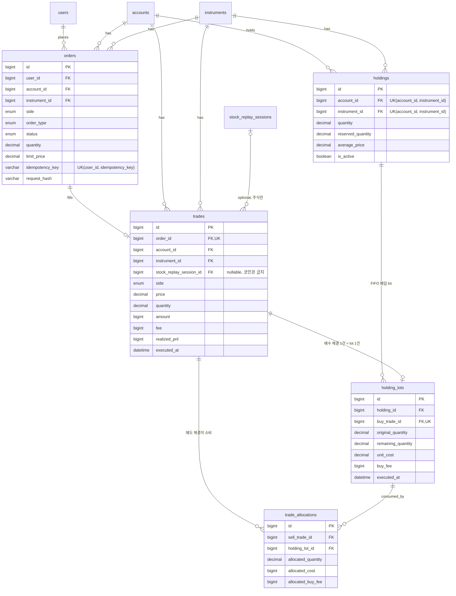
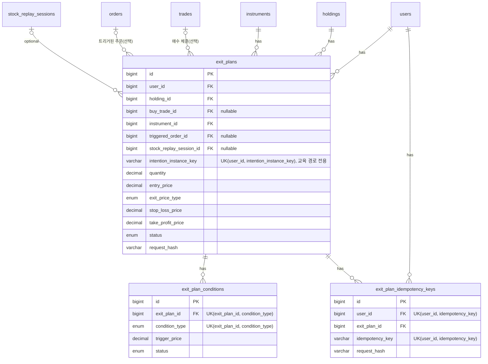
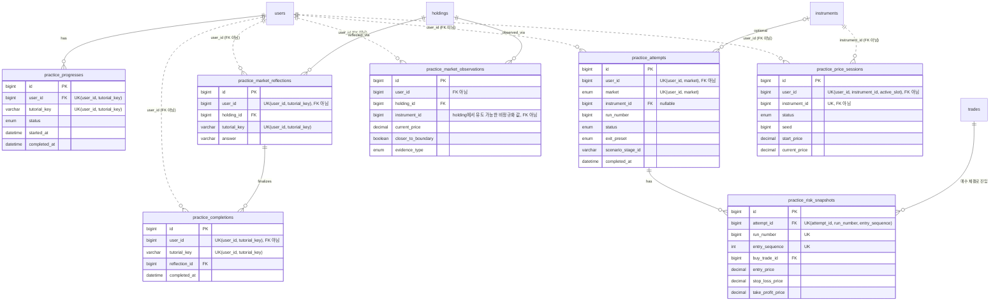
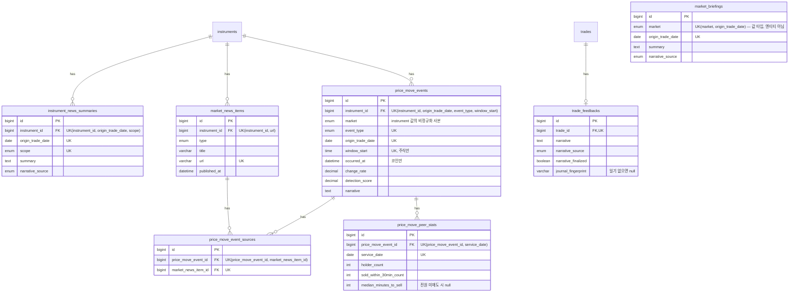
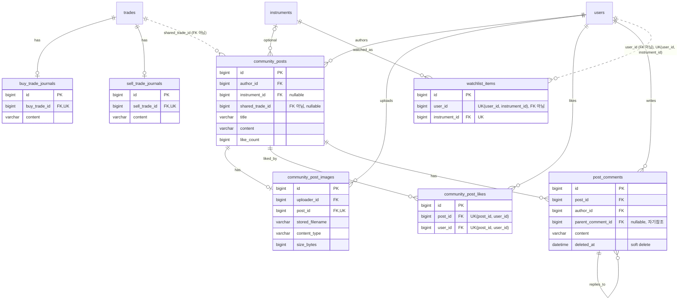

# ERD (Entity Relationship Diagram)

FinPlay 백엔드의 JPA 엔티티와 실제 DB 테이블 구조를 도메인별로 정리한 문서다.

- 기준 커밋: `fb31ac4b` (dev, 2026-08-20 기준 최신)
- 컬럼·연관관계는 `@Entity` 클래스 코드를 기준으로 정리하고, 유니크 제약은 `db/migration/*.sql`의 실제 `UNIQUE` 제약과 대조해 검증했다.

## 엔티티 목록

| 도메인 | 클래스 | 테이블 | 비고 |
|---|---|---|---|
| account | `Account` | `accounts` | |
| account | `TutorialAccount` | `tutorial_accounts` | |
| auth | `User` | `users` | 도메인 전반의 중심 엔티티 |
| auth | `SocialAccount` | `social_accounts` | |
| auth | `RefreshToken` | `refresh_tokens` | |
| auth | `ReauthToken` | `reauth_tokens` | |
| auth | `EmailVerification` | `email_verifications` | User와 FK 없음 (이메일 문자열만) |
| auth | `EmailChangeVerification` | `email_change_verifications` | |
| auth | `PasswordResetVerification` | `password_reset_verifications` | User와 FK 없음 (이메일 문자열만) |
| market | `Instrument` | `instruments` | 여러 도메인이 참조하는 허브 |
| market | `StockCandle` | `stock_candles` | |
| market | `StockReplaySession` | `stock_replay_sessions` | |
| market | `MarketDataImport` | `market_data_imports` | 배치/수집 파이프라인 전용 |
| order | `Order` | `orders` | |
| order | `Trade` | `trades` | |
| order | `ExitPlan` | `exit_plans` | |
| order | `ExitPlanCondition` | `exit_plan_conditions` | |
| order | `ExitPlanIdempotencyKey` | `exit_plan_idempotency_keys` | |
| portfolio | `Holding` | `holdings` | |
| portfolio | `HoldingLot` | `holding_lots` | |
| portfolio | `TradeAllocation` | `trade_allocations` | |
| journal | `BuyTradeJournal` | `buy_trade_journals` | |
| journal | `SellTradeJournal` | `sell_trade_journals` | |
| education | `PracticeProgress` | `practice_progresses` | |
| education | `PracticeAttempt` | `practice_attempts` | 핵심 엔티티, 컬럼 다수 |
| education | `PracticeCompletion` | `practice_completions` | |
| education | `PracticeMarketObservation` | `practice_market_observations` | |
| education | `PracticeMarketReflection` | `practice_market_reflections` | |
| education | `PracticeRiskSnapshot` | `practice_risk_snapshots` | |
| education | `PracticePriceSession` | `practice_price_sessions` | User/Instrument와 FK 없음 |
| feedback | `InstrumentNewsSummary` | `instrument_news_summaries` | |
| feedback | `MarketBriefing` | `market_briefings` | `market`은 값 타입 enum, 엔티티 아님 |
| feedback | `MarketNewsItem` | `market_news_items` | |
| feedback | `PriceMoveEvent` | `price_move_events` | |
| feedback | `PriceMoveEventSource` | `price_move_event_sources` | Event↔News의 M:N 조인 엔티티 |
| feedback | `PriceMovePeerStat` | `price_move_peer_stats` | |
| feedback | `TradeFeedback` | `trade_feedbacks` | |
| community | `CommunityPost` | `community_posts` | |
| community | `CommunityPostImage` | `community_post_images` | |
| community | `CommunityPostLike` | `community_post_likes` | |
| community | `PostComment` | `post_comments` | 자기참조(대댓글 1단계) |
| watchlist | `WatchlistItem` | `watchlist_items` | User와 FK 없음 |

## 관계 표기 범례

- `A ||--o{ B` : 1:N, `B`가 FK로 `A`를 참조 (일반적인 `@ManyToOne`)
- `A ||--o| B` : 1:0..1, FK 컬럼에 `UNIQUE` 제약이 걸려 있어 사실상 1:1에 가까움
- `A ||..o{ B` (점선) : `B`가 `A`의 PK 값을 컬럼에 저장할 뿐 `@ManyToOne`/FK 매핑이 없는 논리적 참조. `education` 도메인 다수 엔티티의 `user_id`, `CommunityPost.sharedTradeId`, `WatchlistItem.userId`가 이 패턴이다.
- 조인 엔티티(`price_move_event_sources`)로 구현된 M:N은 두 개의 `||--o{` 관계로 풀어서 표시한다.

각 다이어그램의 속성 목록은 실제 컬럼 전체가 아니라 ERD 이해에 필요한 주요 컬럼 위주로 추렸다. `PK`/`FK`/`UK` 표시는 각각 기본키, 외래키, (단일 또는 복합)유니크 제약을 뜻하며, 복합 유니크는 컬럼 옆 주석으로 함께 적었다. `users`, `instruments`, `trades`, `accounts`, `holdings`, `orders`는 여러 다이어그램에 허브로 반복 등장하는 동일 엔티티다.

---

## 1. 인증 · 계정

`email_verifications`, `password_reset_verifications`는 `users`와 FK가 없다. 가입 전 이메일이나 소셜 전용 계정 이메일에 대해서도 발송 이력·거부 이력을 남겨야 해서, User row 존재 여부와 무관하게 이메일 문자열만 들고 있는 독립 엔티티다.

## 2. 시세 · 상품 (market)

`stock_replay_sessions`, `market_data_imports`는 다른 엔티티를 FK로 참조하지 않는 독립 테이블이다(리플레이 세션·수집 배치 자체의 상태 기록용). `Trade`, `ExitPlan`이 `stock_replay_sessions`를 선택적으로 참조하는 것은 3번 다이어그램에서 다룬다.

## 3. 주문 · 체결 · 포트폴리오

`orders`→`trades`, `trades`→`holding_lots`는 각각 `uk_trades_order UNIQUE(order_id)`, `uk_holding_lots_buy_trade UNIQUE(buy_trade_id)` 제약으로 실제 DB에서 1:0..1임이 보장된다(주문 1건은 체결 1건까지만, 매수 체결 1건은 lot 1건까지만).

## 4. 손절/익절 예약 (Exit Plan)

## 5. 투자 교육 · 튜토리얼

교육 도메인의 특징: `instrument_id`(일부), `buy_trade_id`, `holding_id`, `reflection_id`처럼 실제 FK로 매핑된 컬럼도 있지만, `user_id`와 `practice_price_sessions.instrument_id`는 어느 엔티티에서도 `@ManyToOne`이 아니라 순수 `Long`/원시 값 컬럼이다. 그럼에도 `practice_progresses`, `practice_attempts`, `practice_completions`, `practice_market_reflections`, `practice_price_sessions`는 이 값에 대해 DB 레벨 `UNIQUE` 제약을 걸어 정합성을 지킨다 — FK 매핑만 없을 뿐 무결성 자체는 포기하지 않은 설계다.

## 6. 피드백 · AI 내러티브

`price_move_event_sources`는 "기사 하나가 여러 카드의 근거가 되고, 카드 하나가 여러 기사를 근거로 둔다"는 N:M을 명시적 조인 엔티티로 구현한 것이다. `market_briefings.market`은 `Instrument.market`과 값이 같은 별도 enum일 뿐 엔티티 참조가 아니라서 관계선이 없다.

## 7. 매매일지 · 커뮤니티 · 관심종목

`CommunityPost.sharedTradeId`는 order 도메인 `Trade`의 id 값만 저장하고 JPA 연관관계로 매핑하지 않는다 — community 도메인이 order 도메인 엔티티를 직접 참조하지 않게 하려는 설계다(`ADR-0002`).
